# CPU Scheduling Simulator

## Group Members

- **Leona Mae Blancaflor**
- **Chrystie Rae A. Sajorne**

---

## Overview

A comprehensive CPU scheduling simulator built in C that implements and compares multiple CPU scheduling algorithms. The simulator generates Gantt charts, calculates performance metrics, and provides detailed analysis of scheduling behavior.

---

## Compilation Instructions

### Prerequisites
- GCC compiler (C99 standard)
- Make build tool
- POSIX-compliant system

### Building the Project

```bash
cd CPU-Scheduling
make clean    # Remove previous builds
make          # Compile the project
```
---

## Usage Instructions

### Basic Syntax
```bash
./schedsim --algorithm=<ALGORITHM> [--input=<FILE> | --processes=<PROCESS_LIST>] [--quantum=<VALUE>] [--compare]
```

### Command-Line Arguments

| Argument | Required | Description |
|----------|----------|-------------|
| `--algorithm=<ALG>` | Yes | Scheduling algorithm: `FCFS`, `SJF`, `STCF`, `RR`, or `MLFQ` |
| `--input=<FILE>` | Conditional | Input file with process definitions (if not using `--processes`) |
| `--processes=<LIST>` | Conditional | Comma-separated process list in format: `"PID:AT:BT"` (e.g., `"A:0:8,B:1:4"`) |
| `--quantum=<TIME>` | No | Time quantum for RR algorithms (default: 30) |
| `--compare` | No | Run comparison mode across all algorithms |

### Input File Format

Each line defines a process with three space-separated values:
```
<PROCESS_ID> <ARRIVAL_TIME> <BURST_TIME>
```

**Example file (`tests/quiz4.txt`):**
```
A 0 240
B 10 180
C 20 150
D 25 80
E 30 130
```

---

## Implemented Features & Algorithms

### CPU Scheduling Algorithms

1. **FCFS (First Come First Served)**
   - Non-preemptive scheduling
   - Processes executed in arrival order
   - Fair but may cause long wait times for later processes
   - Detection of Convoy Effect

2. **SJF (Shortest Job First)**
   - Non-preemptive scheduling
   - Shortest burst time processes scheduled first
   - Minimizes average waiting time
   - Requires knowledge of burst times in advance

3. **STCF (Shortest Time to Completion First)**
   - Preemptive variant of SJF
   - Scheduler checks for shorter processes at each time unit
   - Optimal for minimizing average wait time
   - Preemption and Resumption logs

4. **RR (Round Robin)**
   - Preemptive scheduling
   - Each process gets a fixed time quantum
   - Processes returning to ready queue when quantum expires
   - Better response time and fairness
   - Configurable quantum (default: 30 time units)

5. **MLFQ (Multi-Level Feedback Queue)**
   - Preemptive scheduling with priority levels
   - Multiple queues with different priorities
   - Processes move between queues based on behavior
   - Balances responsiveness and throughput
   - Configurable quantum per queue level

### Additional Features

- **Gantt Chart Generation**: Visual representation of process execution timeline
   - Per unit time counting for short process
   - Scaled for long and small processes
- **Performance Metrics**:
  - Arrival Time (AT)
  - Burst Time (BT)
  - Finish Time (FT)
  - Waiting Time (WT): Time spent waiting in ready queue
  - Turnaround Time (TAT): Total time from arrival to completion
  - Response Time (RT): Time from arrival to first execution
  - Average metrics (TAT, WT, RT) across all processes
  - Detailed Per Process Calculation to Check Answers
- **Process Management**: Tracks process state, arrival, and burst times
- **Event-Driven Simulation**: Efficient event scheduling using min heap
- **Comparison Mode**: Run all algorithms on same input for performance comparison

---

## Example Usage Commands

### 1. FCFS Algorithm with Input File
```bash
./schedsim --algorithm=FCFS --input=tests/quiz4.txt
```
**Output**

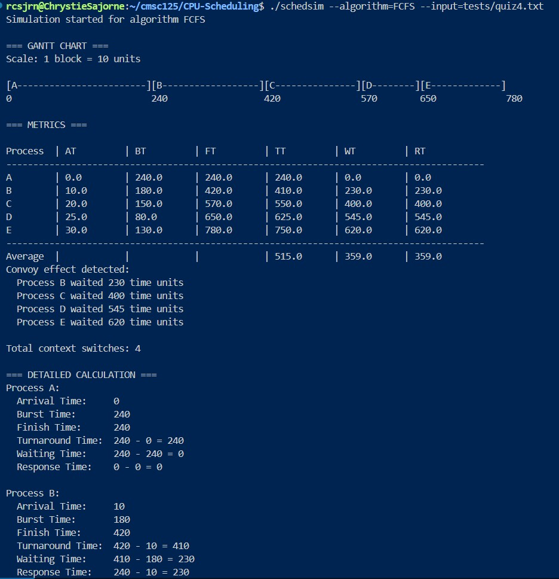

### 2. SJF Algorithm with Command Line Input
```bash
./schedsim --algorithm=SJF --processes="A:0:240,B:10:180,C:20:150,D:25:80,E:30:130"
```
**Output**

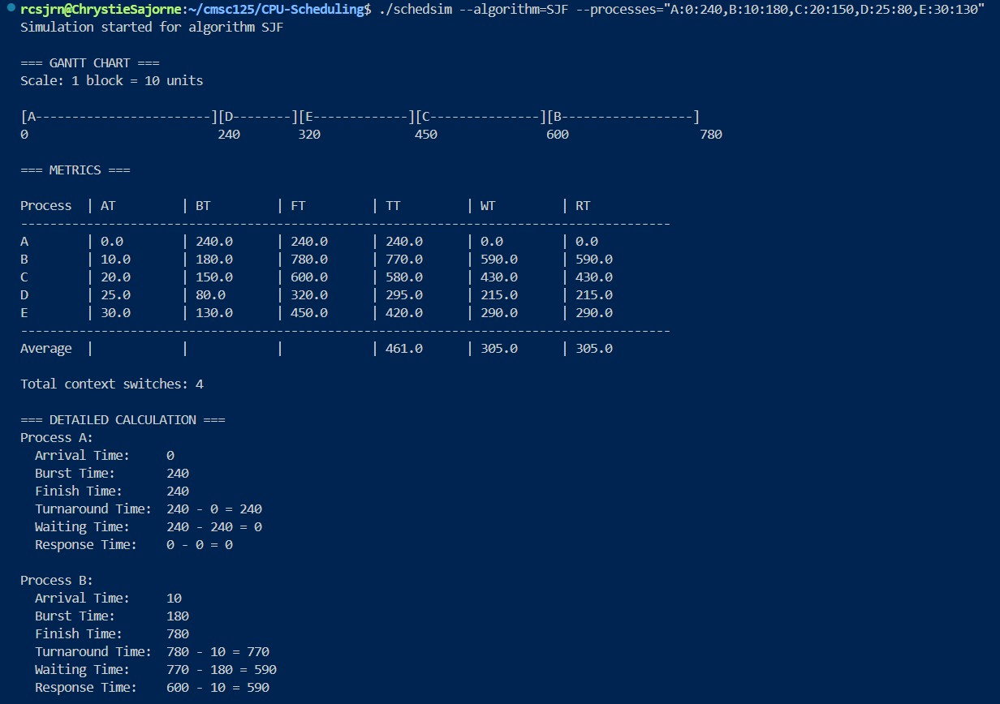

### 3. Round Robin with Custom Quantum
```bash
./schedsim --algorithm=RR --input=tests/quiz4.txt --quantum=20
```
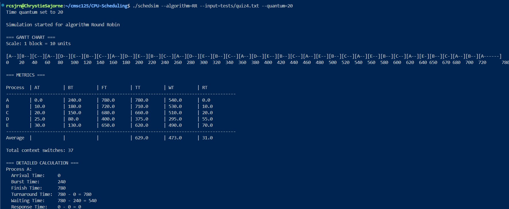

**With default time quantum = 30**
./schedsim --algorithm=RR --input=tests/quiz4.txt 

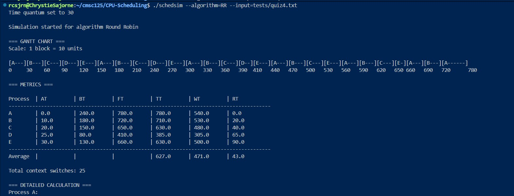

### 4. MLFQ Algorithm
```bash
./schedsim --algorithm=MLFQ --input=tests/quiz4.txt 
```
```bash
./schedsim --algorithm=MLFQ --mlfq-config=mlfq_config.txt --input=tests/quiz4.txt
``` 

**Output**

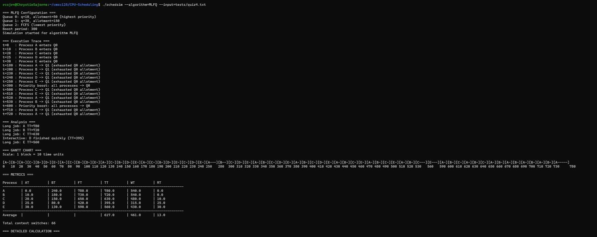

### 5. STCF Algorithm
```bash
./schedsim --algorithm=STCF --input=tests/quiz4.txt 
```
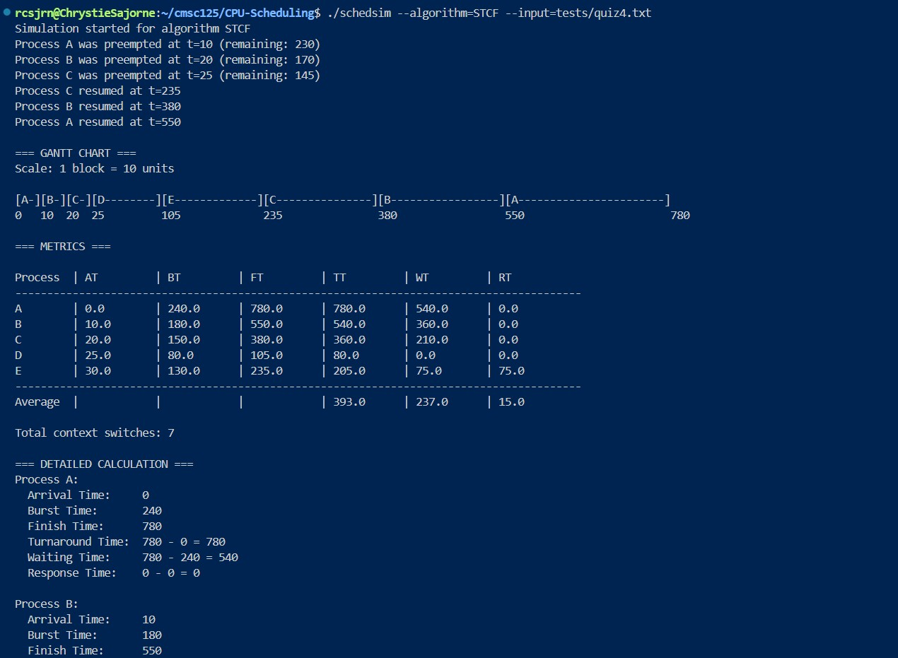

### 6. Compare All Algorithms
```bash
./schedsim --compare --input=tests/quiz4.txt
```

**With time quantum**
```bash
./schedsim --compare --input=tests/quiz4.txt --quantum=20
```
**Command Line Processes**
```bash
./schedsim --compare --processes="A:0:240,B:10:180,C:20:150,D:25:80,E:30:130" --quantum=20
```

**Expected Output:**

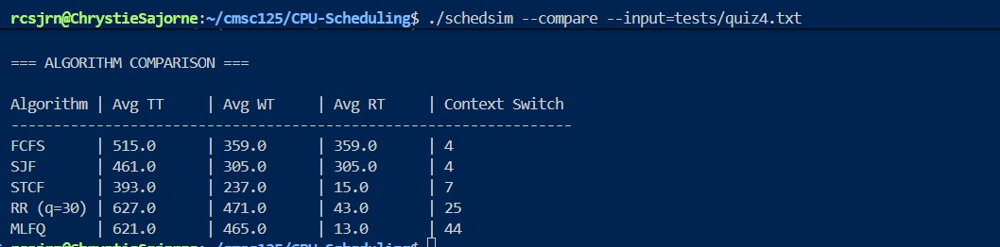

### 7. Detailed Calculation Per Process

**Round Robin Algorithm Example for Quiz 4**

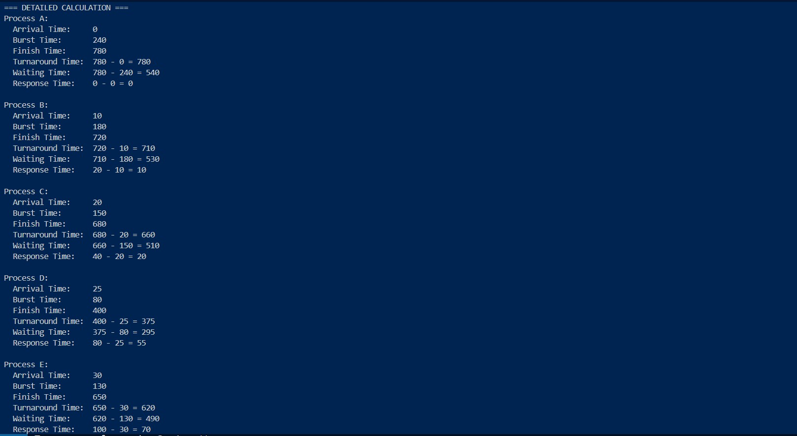

### 8. Automated Test
```bash
make test
```
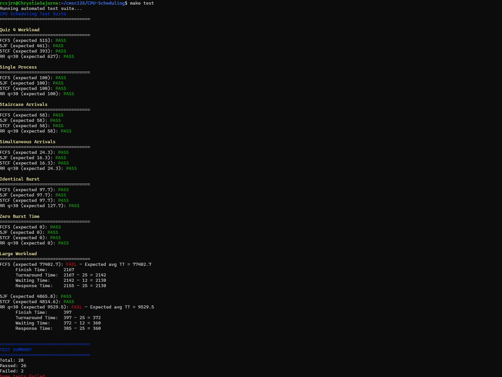


---

## Known Limitations & Assumptions

### Assumptions

1. **Deterministic Arrival & Burst Times**: All process arrival times and burst times are known in advance (no dynamic arrival)
2. **Single CPU Core**: Simulates single-processor scheduling; no multi-core support
3. **No I/O Operations**: Processes don't block for I/O; all time is CPU time
4. **No Priority Levels** (except MLFQ): FCFS, SJF, STCF, RR treat all processes equally (MLFQ has feedback priority)
5. **Preemption without Context Switch Cost**: Assumes context switching is instantaneous with zero overhead
6. **Positive Integer Values**: All arrival times, burst times, and quantum values must be positive integers
7. **Unique Process IDs**: Process identifiers should be unique within a workload

### Limitations

1. **No Process Priority Input**: Cannot specify explicit priority levels from input file (MLFQ priority is dynamic only)
2. **Fixed MLFQ Configuration**
3. **No Aging Mechanism**: Processes can starve in lower priority queues (no anti-starvation aging)
4. **Limited Error Handling**: Malformed input files may cause undefined behavior rather than graceful error messages
5. **Floating Point Metrics**: Average calculations use floating-point, potential for precision issues

### Known Issues

- MLFQ behavior may vary based on queue configuration (not fully documented)
- Comparison mode assumes all algorithms complete; may hang on certain edge cases

---

## Project Structure

```
CPU-Scheduling/
├── src/                    # Implementation files
│   ├── main.c             # Entry point with argument parsing
│   ├── scheduler.c        # Core scheduling engine
│   ├── fcfs.c            # FCFS algorithm implementation
│   ├── sjf.c             # SJF algorithm implementation
│   ├── stcf.c            # STCF algorithm implementation
│   ├── rr.c              # Round Robin algorithm implementation
│   ├── mlfq.c            # MLFQ algorithm implementation
│   ├── process.c         # Process management
│   ├── heap.c            # Min heap data structure
│   ├── gantt.c           # Gantt chart generation
│   ├── metrics.c         # Performance metrics calculation
│   ├── compare.c         # Algorithm comparison mode
│   └── utils.c           # Utility functions
├── include/               # Header files
│   ├── scheduler.h       # Scheduler interface
│   ├── process.h         # Process structures
│   ├── gantt.h           # Gantt chart interface
│   ├── metrics.h         # Metrics calculation interface
│   ├── heap.h            # Heap interface
│   └── mlfq.h
    └── compare.h
├── tests/                           # Test input files
│   ├── quiz4.txt                    # Sample workload
│   ├── expected_results.txt         # Expected Results from test cases
│   └── test_suite.sh                # Test script      
│   ├── simultaneous_arrivals.txt    # Additional edge cases
│   └── single_process.txt           # Additional edge cases                   
│   ├── staircase_arrivals.txt       # Additional edge cases
│   └── zero_burst.txt               # Additional edge cases    
│   ├── identical_burst.txt          # Additional test cases
│   └── single_process.txt           # Additional test cases
    └── large_workload.txt           # Additional test cases
├── docs/                 # Documentation
│   └── mlfq_design.md    # MLFQ design documentation
├── Makefile              # Build configuration
└── README.md            
```

---

## Cleaning Up

To remove compiled files and binaries:
```bash
make clean
```

## Automatest test

```bash
make test
```
## Gantt Chart for Different Workloads

**Not Scaled**

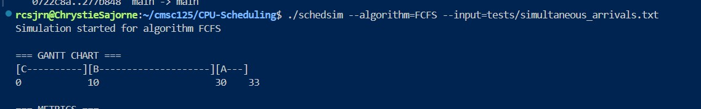

**Scaled**

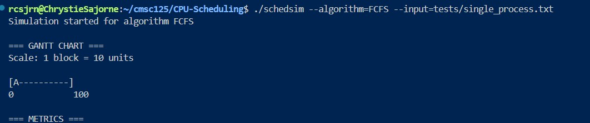

## MLFQ Workloads

**Configuration**
Number of Qeueu: 3
10 50 
20 160
-1 -1 
Boost Period: 300

**Short Jobs**

<img src="images/short.jpg" alt="All Short Jobs" 

**Long Jobs**

<img src="images/long.jpg" alt="All Long Jobs" 

**Mixed Workload**

<img src="images/mixed.jpg" alt="Mixed Workloads" 

**Bimodal Workload**

<img src="images/bimodal.jpg" alt="Bimodal Workloads" 
---

## License

This project was developed for CMSC 125 (Operating Systems) coursework.
